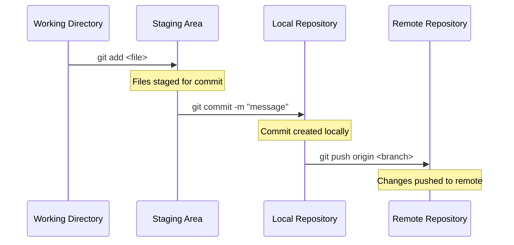
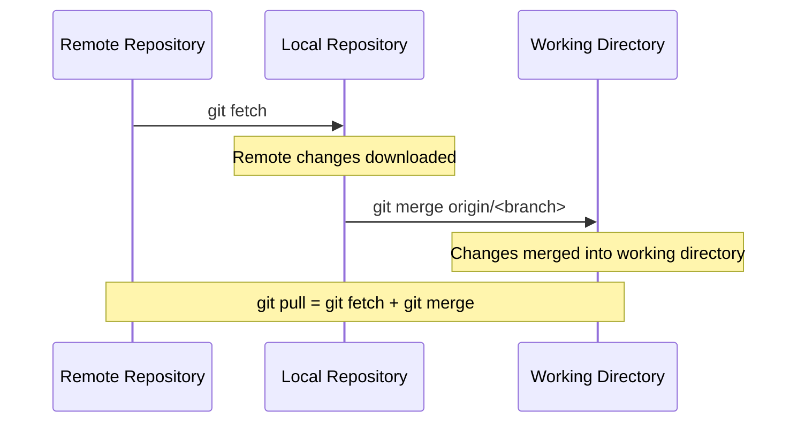
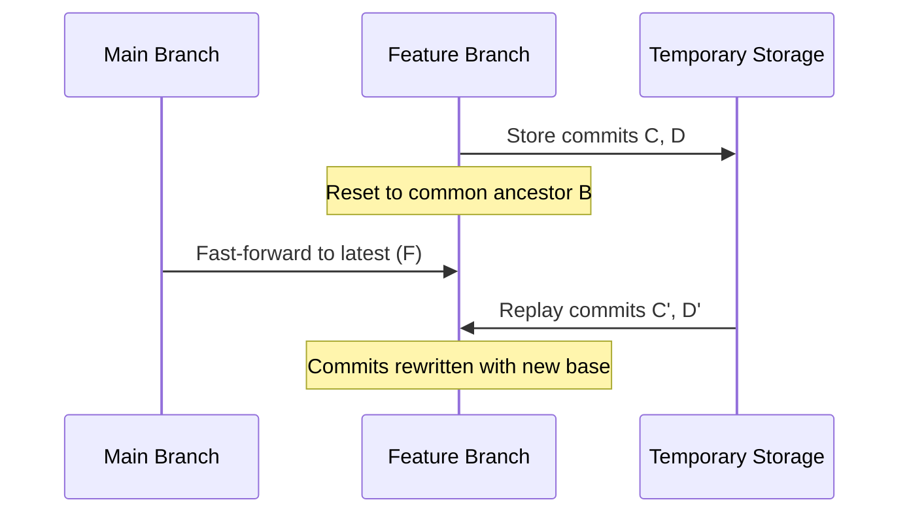
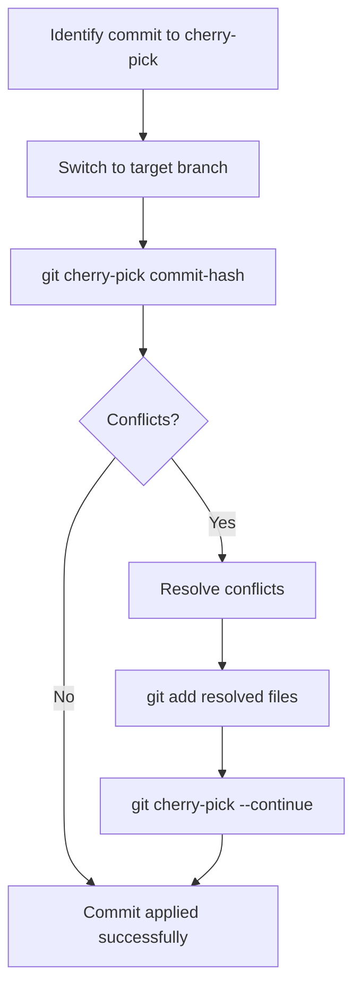
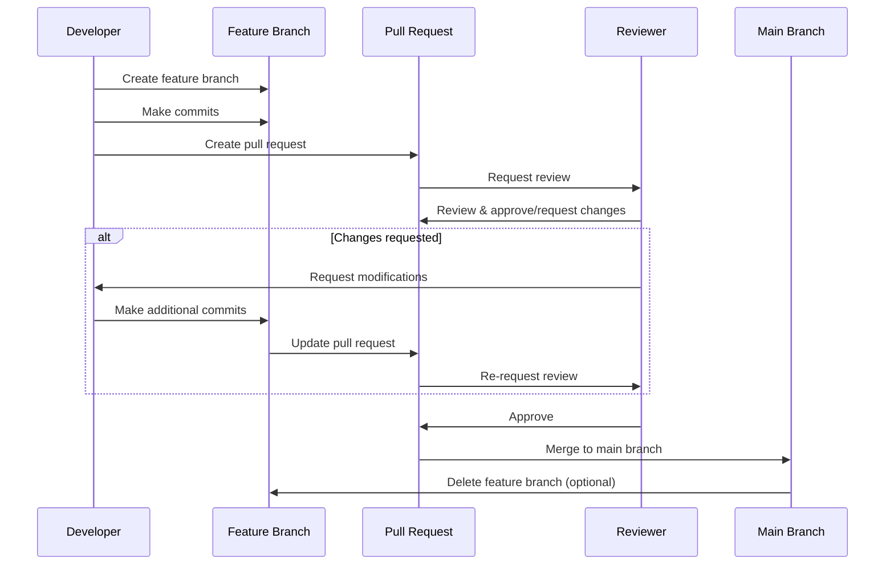
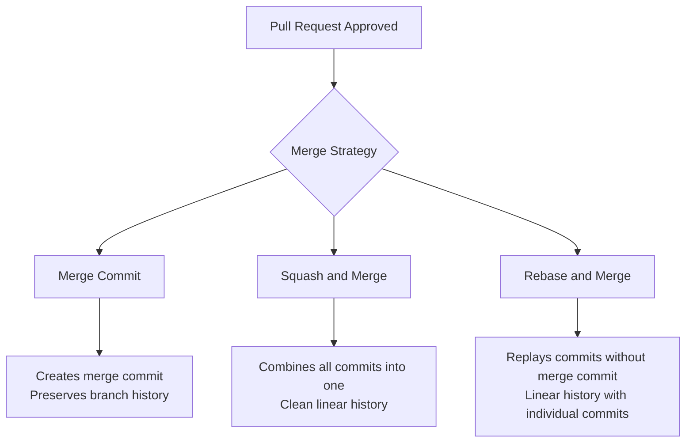

# Counting
Project to explain git workflows to students

Slides : https://docs.google.com/presentation/d/16eEDMDin6eRqLmcMi7e1N0vbOjkd0vI-u4j8MSAmP2g/edit?usp=sharing

# Git Operations

## add / commit / push

The basic workflow for adding changes to a repository.

## pull

Fetching and merging changes from remote repository.

## rebase

Reapplying commits on top of another base tip.

Alternative view:

## cherry pick

Applying specific commits from one branch to another.

Process flow:

## pull / merge request

Collaborative workflow for code review and integration.

Merge strategies:

